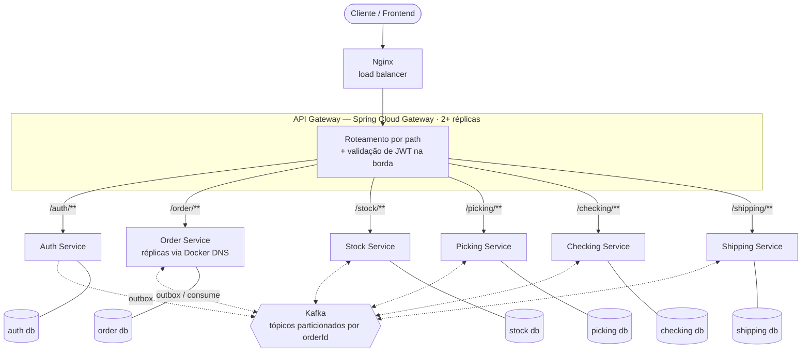
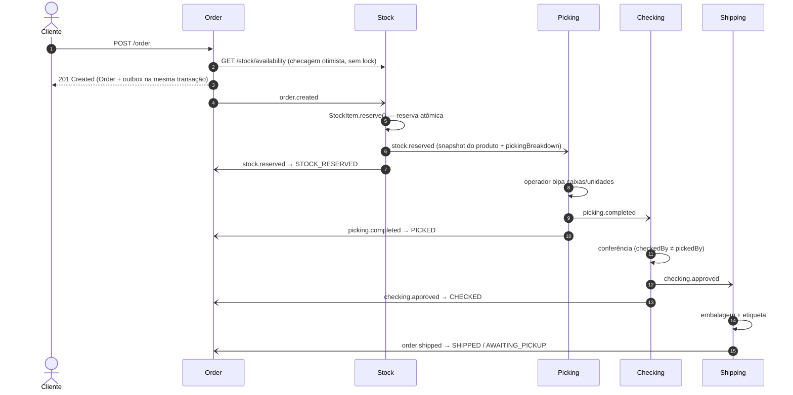
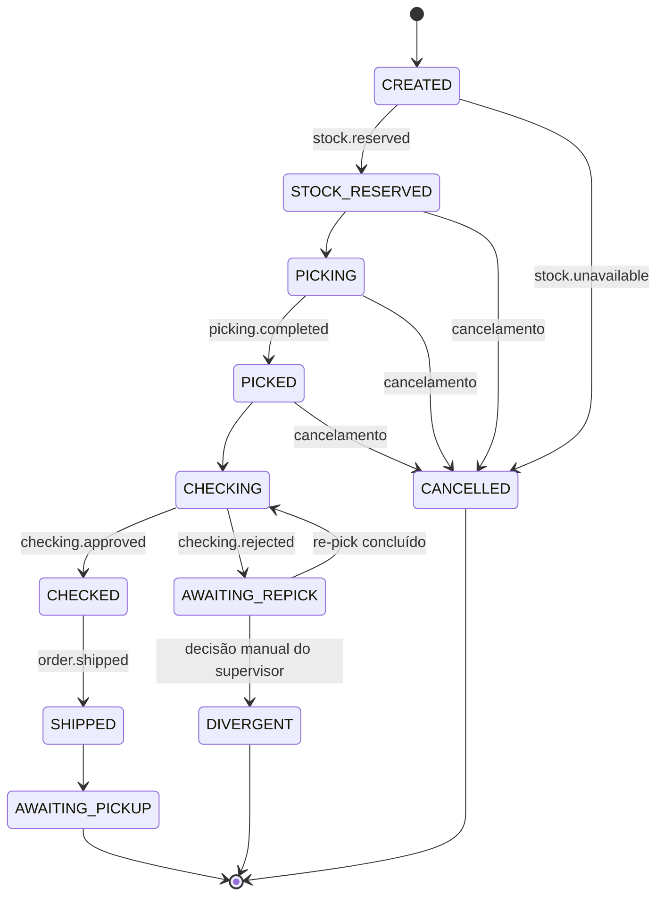

<p align="center">
  
</p>

<p align="center">
  Sistema de gestão de pedidos para armazém (WMS) construído como <b>microsserviços desacoplados em Java</b>, comunicando via <b>Kafka</b>, com <b>multi-tenancy</b>, <b>outbox pattern</b>, <b>consumidores idempotentes</b> e validação de capacidade por <b>teste de estresse</b>.
</p>

<p align="center">
  
  
  
  
  
  
</p>

> [!WARNING]
> **🚧 Projeto em desenvolvimento.** Auth Service, Order Service, API Gateway e Nginx já estão funcionais; o Stock Service está em implementação e Picking, Checking e Shipping ainda não foram iniciados. Partes da arquitetura descrita abaixo representam o **design alvo** — veja o [status do projeto](#status-do-projeto) para saber o que já está implementado.

Projeto de estudo e portfólio que simula o fluxo real de um armazém logístico, **do recebimento do pedido até a expedição**: reserva de estoque → separação (*pick*) → conferência (*check*) → embalagem e expedição (*ship*). Várias contas convivem isoladas na mesma infraestrutura.

---

## Sumário

- [Motivação](#motivação)
- [Domínio](#domínio)
- [Arquitetura](#arquitetura)
- [Stack](#stack)
- [Serviços (bounded contexts)](#serviços-bounded-contexts)
- [Coreografia de eventos](#coreografia-de-eventos)
- [Ciclo de vida do pedido](#ciclo-de-vida-do-pedido)
- [Patterns e técnicas](#patterns-e-técnicas)
- [Decisões de arquitetura](#decisões-de-arquitetura)
- [Estratégia de testes](#estratégia-de-testes)
- [Estrutura do repositório](#estrutura-do-repositório)
- [Como rodar localmente](#como-rodar-localmente)
- [Status do projeto](#status-do-projeto)
- [Fora de escopo](#fora-de-escopo-deliberadamente)

---

## Motivação

O objetivo não é "fazer um CRUD distribuído", e sim enfrentar os problemas que aparecem de verdade quando um sistema é dividido em serviços independentes:

- **Desacoplamento real** — sem banco compartilhado, sem import cruzado de código entre serviços.
- **Consistência sem transação distribuída** — escrita local e publicação de evento atômicas via *outbox*.
- **Idempotência sob entrega duplicada** — Kafka é *at-least-once*; reentrega não pode corromper saldo.
- **Isolamento de dados entre contas** — `workspaceId` como chave de particionamento em todo serviço.
- **Comportamento sob carga** — escalabilidade horizontal do gateway e validação com k6.

## Domínio

Empresas de logística com armazéns que mantêm grandes volumes de estoque e recebem pedidos de clientes. Cada pedido precisa passar por **separação**, **conferência** e **expedição** antes de aguardar coleta pela transportadora.

- Cada conta (`Workspace`) representa uma empresa com **um único armazém** (relação 1:1 deliberada). Por isso não existe um `warehouseId` circulando pelo sistema — o `workspaceId` já identifica o armazém.
- Usuários têm papéis operacionais: `PICKER`, `CHECKER`, `SUPERVISOR` e `ADMIN`.
- Produtos seguem uma **hierarquia de embalagem em 3 níveis** definida pelo fabricante: unidade → *inner box* → caixa *master*.
- Endereçamento físico no armazém: `bloco / corredor / coluna / nível`.

## Arquitetura



**Pontos-chave da topologia:**

- O **Nginx balanceia entre réplicas do API Gateway**, não do Order Service. Como o Gateway processa *toda* requisição de *todos* os serviços, ele é o componente mais provável de saturar primeiro sob carga — é ali que a escala horizontal importa.
- Réplicas dos serviços internos (ex.: Order Service) são resolvidas pelo **DNS interno do Docker** (round-robin), sem precisar de um segundo load balancer.
- O JWT é validado **duas vezes**: no Gateway (rejeita na borda) e de novo em cada serviço, de forma independente — **defesa em profundidade**, totalmente *stateless*.
- Cada serviço tem **seu próprio PostgreSQL**; a comunicação entre serviços de domínio é **assíncrona via Kafka**.

## Stack

| Camada              | Tecnologia                                                                  |
| ------------------- | --------------------------------------------------------------------------- |
| Backend             | Java 21 · Spring Boot 4.1 · Spring Data JPA · Spring Security (OAuth2 Resource Server) · Spring Kafka · Lombok |
| API Gateway         | Spring Cloud Gateway (WebFlux) · Spring Cloud 2025.1                        |
| Load balancer       | Nginx (na frente do Gateway)                                                |
| Mensageria          | Apache Kafka 3.8 em modo **KRaft** (sem ZooKeeper)                          |
| Banco de dados      | PostgreSQL 16 — uma instância/schema independente por serviço               |
| Autenticação        | JWT stateless (HS256) emitido pelo Auth Service · hash de senha com Argon2  |
| Build               | Gradle (Kotlin DSL) — um projeto independente por serviço                  |
| Testes              | JUnit · Testcontainers (Postgres + Kafka reais) · WireMock                  |
| Orquestração local  | Docker Compose                                                              |
| Teste de carga      | k6                                                                          |
| Observabilidade dev | Kafka UI ([ADR 001](#adrs))                                                 |
| Frontend (planejado)| Next.js · TypeScript · Tailwind · React Query · Zustand · React Hook Form · Bun |

## Serviços (bounded contexts)

| Serviço              | Responsabilidade                                                                 | Aggregate roots                         | Consome                                                                                           | Publica                                                                 |
| -------------------- | -------------------------------------------------------------------------------- | --------------------------------------- | ------------------------------------------------------------------------------------------------- | ----------------------------------------------------------------------- |
| **Auth Service**     | Autentica usuários, emite o JWT, origem do `workspaceId`                         | `Workspace`, `User`                     | —                                                                                                 | `workspace.deleted`                                                     |
| **Order Service**    | Porta de entrada REST, ciclo de vida/status do pedido, cadastro de sellers       | `Order`, `Seller`                       | `stock.reserved`, `stock.unavailable`, `picking.completed`, `checking.approved`, `checking.rejected`, `order.shipped` | `order.created`, `order.cancelled`                                      |
| **Stock Service**    | Cadastro de armazém e produto, saldo e reserva de itens                          | `Warehouse`, `Product`, `StockItem`     | `order.created`, `order.cancelled`, `stock.discrepancy_reported`                                  | `stock.reserved`, `stock.unavailable`                                   |
| **Picking Service**  | Instrui o operador sobre o que separar e acompanha a bipagem                     | `PickingTask`                           | `stock.reserved`, `checking.rejected`, `order.cancelled`                                          | `picking.completed`                                                     |
| **Checking Service** | Confere os itens separados contra o pedido (segregação de função)                | `CheckingTask`                          | `picking.completed`, `order.cancelled`                                                            | `checking.approved`, `checking.rejected`, `stock.discrepancy_reported`  |
| **Shipping Service** | Embalagem, etiqueta/documento de expedição, pronto para coleta                   | `Shipment`                              | `checking.approved`                                                                               | `order.shipped`                                                         |

Todos os serviços de domínio também consomem `workspace.deleted` para apagar os próprios dados daquela conta.

### Endpoints do Auth Service

| Método & path                    | Acesso        | Descrição                                                                                   |
| -------------------------------- | ------------- | ------------------------------------------------------------------------------------------- |
| `POST /auth/signup`              | público       | Cria `Workspace` + primeiro `User` (ADMIN) na mesma transação e já autentica               |
| `POST /auth/login`               | público       | Valida credencial e emite o JWT (`sub`, `operatorId`, `workspaceId`, `role`, `iat`, `exp`) |
| `POST /auth/logout`              | autenticado   | Expira o cookie de sessão                                                                   |
| `POST /auth/user`                | ADMIN         | Cria funcionário dentro do workspace do chamador                                            |
| `GET /auth/user`                 | ADMIN         | Lista usuários **apenas** do workspace do chamador                                          |
| `GET /auth/user/{userId}`        | autenticado   | Próprios dados; ADMIN vê colegas do mesmo workspace. Id de outro tenant → **404** (não 403) |
| `DELETE /auth/workspaces/{id}`   | ADMIN         | Exclui o **próprio** Workspace + usuários e grava `workspace.deleted` na outbox             |

O JWT é entregue num cookie `access_token` (`HttpOnly`, `SameSite=Strict`), nunca no corpo da resposta — o token não fica acessível a JavaScript. Senhas são armazenadas com **Argon2id** e nenhuma resposta expõe `passwordHash`. Erros seguem o formato **ProblemDetail (RFC 9457)**.

### Endpoints do Order Service

| Método & path                     | Acesso      | Descrição                                                                                 |
| --------------------------------- | ----------- | ----------------------------------------------------------------------------------------- |
| `POST /order`                     | ADMIN       | Cria o pedido e grava `order.created` na outbox                                           |
| `GET /order`                      | autenticado | Lista paginada, filtros `orderNumber`, `customerName`, `seller`, `status`                 |
| `GET /order/{orderId}`            | autenticado | Detalhe do pedido; outro workspace → **404**                                              |
| `POST /order/cancel/{orderId}`    | ADMIN       | Cancela com `cancellationReason` e grava `order.cancelled` na outbox                      |
| `GET /order/seller`               | autenticado | Lista paginada de sellers, filtros `name` e `document`                                    |
| `POST /order/seller`              | ADMIN       | Cadastra seller (documento único por workspace → 409 se duplicado)                        |
| `PUT /order/seller/{sellerId}`    | ADMIN       | Renomeia seller                                                                           |
| `DELETE /order/seller/{sellerId}` | ADMIN       | Exclui seller sem pedidos (com pedidos → 409)                                             |

Listagens usam Spring Data `Specification` para compor filtros opcionais, sempre começando pelo filtro de `workspaceId`.

## Coreografia de eventos

Não há orquestrador central: cada serviço reage a eventos e publica os seus. O fluxo feliz de um pedido:



### Tópicos Kafka

| Tópico                        | Produtor | Consumidor(es)                              | Chave de partição |
| ----------------------------- | -------- | ------------------------------------------- | ----------------- |
| `order.created`               | Order    | Stock                                       | `orderId`         |
| `order.cancelled`             | Order    | Stock, Picking, Checking                    | `orderId`         |
| `stock.reserved`              | Stock    | Picking, Order                              | `orderId`         |
| `stock.unavailable`           | Stock    | Order                                       | `orderId`         |
| `picking.completed`           | Picking  | Checking, Order                             | `orderId`         |
| `checking.approved`           | Checking | Shipping, Order                             | `orderId`         |
| `checking.rejected`           | Checking | Picking, Order                              | `orderId`         |
| `stock.discrepancy_reported`  | Checking | Stock                                       | `sku`             |
| `order.shipped`               | Shipping | Order                                       | `orderId`         |
| `workspace.deleted`           | Auth     | Order, Stock, Picking, Checking, Shipping   | `workspaceId`     |

Particionar por `orderId` (globalmente único entre contas) garante **ordem dos eventos por pedido**. Todo payload carrega `workspaceId`.

## Ciclo de vida do pedido



- **Rejeição na conferência** → `checking.rejected` + `stock.discrepancy_reported`. O pedido vai para `AWAITING_REPICK` e **fica travado de propósito** até resolução manual; o Picking Service cria uma nova tarefa só dos itens faltantes, com `attempt` incrementado.
- **`DIVERGENT` só por decisão manual de supervisor** — nunca por contagem automática de tentativas.
- **Cancelamento** é permitido até `PICKED`. Pedidos não podem ser editados depois de criados (não existe evento de atualização — o Stock já reservou a partir do payload original); em vez disso, o cliente cancela e o `order.cancelled` devolve a reserva e encerra tarefas em andamento.

## Patterns e técnicas

### Transactional Outbox
Cada serviço que publica eventos tem uma tabela `outbox` genérica (`id`, `event_type`, `payload JSONB`, `published`, `created_at`). A operação de negócio grava a linha **na mesma transação** da escrita principal; um *poller* (`@Scheduled`) publica as linhas pendentes no Kafka e marca `published = true` após o *ack* do broker. Se o poller cair no meio, a linha é republicada na próxima execução. Com múltiplas instâncias, o poller usa **`SELECT ... FOR UPDATE SKIP LOCKED`** para que duas réplicas não publiquem a mesma linha.

> Resolve o problema de *dual write* (gravar no banco e publicar no broker sem garantia atômica) sem recorrer a transação distribuída.

### Idempotência por consumer (não uma regra única)
Antes de escrever um `@KafkaListener`, a pergunta é: *aplicar este evento duas vezes dá o mesmo resultado que aplicar uma vez?*

| Consumer                                   | Operação                              | Precisa de dedup?                 |
| ------------------------------------------ | ------------------------------------- | --------------------------------- |
| Stock consome `order.created`              | decrementa saldo                      | **Sim** — registra `event_id`     |
| Stock consome `order.cancelled`            | devolve saldo                         | **Sim**                           |
| Picking consome `checking.rejected`        | cria nova tarefa de re-pick           | **Sim**                           |
| Todos consomem `workspace.deleted`         | `DELETE ... WHERE workspace_id = :id` | Não — idempotente por natureza    |

Evita tanto a falta de proteção quanto o *overhead* de uma tabela de controle onde a operação já converge sozinha.

### Event-Carried State Transfer
O `stock.reserved` carrega um **snapshot do produto** (nome, peso, dimensões, embalagem, localização) e o **`pickingBreakdown`** calculado. O Picking Service nunca precisa consultar o Stock Service de volta — os serviços continuam independentes em tempo de execução.

### Reserva de estoque como regra do Aggregate (estratégia gulosa)
`StockItem.reserve(quantity)` decide a composição da reserva priorizando o **nível de embalagem mais fechado** (master → inner → unidade solta), minimizando bipagem física e abertura desnecessária de caixas. Quando é preciso quebrar um nível (ex.: abrir uma master para tirar 4 unidades), o saldo restante daquela caixa é reincorporado às unidades soltas.

**Divisão de responsabilidade:** o Stock decide *o quê* e *como* separar (cálculo puro); o Picking só instrui e acompanha a execução física (`PickingTask.scan(sku, barcode)` resolvido localmente); o operador só executa. Nenhuma decisão de composição é tomada em tempo real durante o picking.

### Checagem híbrida de estoque
Na criação do pedido, uma **checagem otimista síncrona** (`GET /stock/availability`, sem lock) devolve `422` rápido quando claramente não há saldo. A **reserva de verdade** é assíncrona e atômica no Stock Service, com update condicional (`... WHERE available >= :qty`), publicando `stock.reserved` ou `stock.unavailable`. Boa experiência para o cliente sem abrir mão da consistência.

### Multi-tenancy por `workspaceId`
- Todo endpoint autenticado extrai `workspaceId` do JWT — nunca do corpo da requisição.
- Toda escrita grava com ele; toda leitura filtra por ele.
- Todo evento carrega `workspaceId` no payload.
- Acesso a recurso de outro tenant retorna **404, não 403** — não confirma que aquele id existe em outra conta (*anti-enumeration*).

### Segregação de função
Picking e Checking são **serviços distintos**, e `pickedBy`/`checkedBy` vêm do `operatorId` do token autenticado — o operador não consegue falsificar a própria identidade. O Checking recusa a conferência se `checkedBy == pickedBy`.

### DDD tático
- *Aggregate roots* por bounded context, com regras de negócio dentro do próprio aggregate (`reserve`, `scan`).
- *Value Objects* imutáveis com `record` + `@Embeddable` (`Address`, `Party`, `Packaging`, `Location`).
- `sender` e `recipient` do pedido reaproveitam o mesmo VO `Party`, diferenciados pelo nome do campo e mapeados com `@AttributeOverrides` para colunas prefixadas (`sender_street`, `recipient_street`...) — DRY **dentro** do serviço.

### Exclusão de conta coreografada
`DELETE /auth/workspaces/{id}` apaga Workspace + usuários numa transação e grava `workspace.deleted` na outbox. Cada serviço de domínio apaga os próprios registros, sem ordem obrigatória entre eles. Exclusão imediata e definitiva — decisão consciente para um projeto de demonstração (um produto real precisaria de retenção por obrigações fiscais/contábeis).

## Decisões de arquitetura

| Decisão                                                         | Alternativa descartada                 | Por quê                                                                                                                   |
| --------------------------------------------------------------- | -------------------------------------- | ------------------------------------------------------------------------------------------------------------------------- |
| **Kafka**                                                       | RabbitMQ                               | Particionamento com ordem por chave, *replay*, retenção; mais complexidade em troca de mais aprendizado e diferencial     |
| **Coreografia**                                                 | Orquestração central (saga orquestrada) | Serviços reagem a eventos sem um coordenador que concentre conhecimento de todo o fluxo                                   |
| **Outbox pattern**                                              | *Dual write*                           | Atomicidade entre estado local e evento sem transação distribuída                                                         |
| **Banco independente por serviço**                              | Banco compartilhado                    | Autonomia de schema e deploy; nenhum serviço lê a tabela de outro                                                         |
| **Picking e Checking separados**                                | Um único serviço de "fulfillment"      | Segregação de função real, equipes distintas                                                                              |
| **`AWAITING_REPICK` travado, `DIVERGENT` manual**               | Retentativa automática com limite      | Divergência de estoque é problema físico; exige decisão humana                                                            |
| **`workspaceId` como chave universal (1 conta = 1 armazém)**    | `warehouseId` separado                 | Simplifica isolamento; múltiplos armazéns por conta está fora de escopo                                                  |
| **Gateway atrás do Nginx**                                      | Nginx direto no Order Service          | O Gateway processa todo o tráfego — é ele que satura primeiro                                                             |
| **JWT stateless validado no Gateway e em cada serviço**         | Validação só na borda / IAM completo   | Defesa em profundidade sem estado compartilhado; Keycloak/Auth0 seria desproporcional                                     |
| **Cada serviço é um projeto Gradle independente**               | Build multi-módulo com `settings.gradle` raiz | Multi-module existe para compartilhar código — aqui a regra é o oposto                                            |
| **`SecurityConfig` duplicada em cada serviço**                  | Lib compartilhada via composite build  | Ver ADR 002                                                                                                               |

### ADRs

- **ADR 001 — Kafka UI para observabilidade em dev.** Adicionar Kafka UI como container local para inspecionar tópicos, *throughput* e *consumer lag* durante o teste de estresse (inclusive confirmar que duplicatas são tratadas pela idempotência). Alternativas avaliadas: `kcat`, Confluent Control Center, AKHQ, Redpanda Console. Ferramenta exclusiva de desenvolvimento — não substitui observabilidade real (Prometheus/Grafana).
- **ADR 002 — Duplicar `SecurityConfig` entre serviços, sem lib compartilhada.** Um `libs/security-starter` via Gradle composite build foi considerado e **revertido**: resolveria a duplicação, mas criaria sincronização forçada — qualquer mudança afetaria os 6 serviços no próximo build. Um artefato versionado resolveria isso, mas exigiria infraestrutura de publicação desproporcional ao projeto. **Regra geral adotada:** duplicação *entre* serviços independentes é aceitável quando o código é (1) infraestrutura pura, (2) pequeno e estável e (3) não se repete *dentro* de um mesmo serviço. Consequência aceita: uma mudança como HS256 → RS256 precisa ser replicada manualmente.

## Estratégia de testes

O projeto segue o **Testing Honeycomb** (Spotify) em vez da pirâmide clássica: em microsserviços orientados a eventos, a maioria dos bugs vive nas **fronteiras**, não dentro de unidades isoladas.

| Camada                      | Peso       | O que cobre                                                                                     |
| --------------------------- | ---------- | ----------------------------------------------------------------------------------------------- |
| **Integração**              | Maior      | Endpoint real + banco real do serviço (Testcontainers) + Kafka real, contratos entre serviços   |
| **Unitário**                | Pequena    | Só regra de negócio complexa e isolada (ex.: composição gulosa da reserva, política de senha)   |
| **End-to-end**              | Fatia fina | Sistema completo, antes de release                                                               |

**Regras:**

- **Endpoints: cobertura completa** — caminho feliz + cada erro com status HTTP distinto (400, 401, 403, 404, 409, 422). Não se testam 15 variações do mesmo erro de Bean Validation.
- **Unitário só quando agrega:** *"se eu apagar este teste, algum outro deixaria de detectar o mesmo bug?"* Perseguir % de cobertura é tratado como antipadrão (Lei de Goodhart).
- **Mock apenas do que é externo ao serviço.** O banco do próprio serviço é sempre real; a chamada síncrona Order → Stock é mockada com WireMock.
- **Source sets separados no Gradle:** `src/test` (unitário, rápido) e `src/integrationTest` (Testcontainers, precisa de Docker). `./gradlew check` roda ambos.

```bash
./gradlew test             # unitários
./gradlew integrationTest  # integração (Docker necessário)
./gradlew check            # tudo
```

**Evolução futura:** *contract tests* com Spring Cloud Contract, para garantir que o payload de `order.created` publicado pelo Order continua batendo com o que o Stock consome, sem subir os dois serviços juntos.

## Estrutura do repositório

```
pick-pack-ship-wms/
├── docker-compose.yml
├── .env.example
├── nginx/
│   └── nginx.conf              # LB na frente das réplicas do Gateway
├── gateway/
│   └── api-gateway/            # Spring Cloud Gateway (projeto Gradle independente)
├── services/                   # cada um é um projeto Gradle independente, com Dockerfile próprio
│   ├── auth-service/
│   ├── order-service/
│   ├── stock-service/
│   ├── picking-service/
│   ├── checking-service/
│   └── shipping-service/
├── contracts/
│   └── events/                 # JSON Schema versionado de cada tópico Kafka
├── docs/                       # escopo, especificação técnica, brand, ADRs
├── frontend/                   # Next.js + Bun (planejado)
├── load-test/k6/               # cenários de carga (planejado)
└── .github/workflows/ci.yml    # unit → integration (planejado)
```

**Por que não existe `libs/` ou `packages/`:** a ausência é intencional. Nenhum código — nem de domínio, nem de infraestrutura — é compartilhado entre serviços (ver ADR 002). O que acopla os serviços de verdade são os **contratos de evento**, por isso eles ficam centralizados e visíveis em `contracts/events/`.

**Por que `gateway/` fica fora de `services/`:** tecnicamente ele é só mais um deployável, mas separá-lo sinaliza que tem um papel diferente — porta de entrada, não lógica de negócio.

## Como rodar localmente

**Pré-requisitos:** Docker e Docker Compose. Para rodar testes fora do container: JDK e Docker (Testcontainers).

1. Crie o `.env` a partir do exemplo e preencha os valores:

   ```bash
   cp .env.example .env
   ```

   | Variável            | Descrição                                                                  |
   | ------------------- | -------------------------------------------------------------------------- |
   | `JWT_SECRET`        | Segredo HMAC-SHA256 compartilhado por Gateway e serviços (≥ 32 bytes)      |
   | `AUTH_DB_PASSWORD`  | Senha do Postgres do Auth Service                                          |
   | `ORDER_DB_PASSWORD` | Senha do Postgres do Order Service                                         |

2. Suba o ambiente:

   ```bash
   docker compose up --build
   ```

   A API fica exposta via Nginx em **http://localhost:8080** (ex.: `POST http://localhost:8080/auth/signup`). O Nginx repassa o path sem reescrita, então não há prefixo `/api`.

3. Simule múltiplas instâncias do Gateway (o componente que satura primeiro) ou do Order Service:

   ```bash
   docker compose up --scale api-gateway=2
   docker compose up --scale order-service=2
   ```

> **Nota:** o ambiente roda numa única máquina — valida lógica de concorrência, balanceamento e idempotência, mas não reproduz latência de rede real nem isolamento de recursos por instância.

### Teste de carga (planejado)

```bash
k6 run load-test/k6/create-order.js
```

## Status do projeto

Projeto em desenvolvimento ativo.

| Componente                         | Status                                              |
| ---------------------------------- | --------------------------------------------------- |
| Nginx + API Gateway                | ✅ Integrados ao docker-compose                     |
| Auth Service                       | ✅ Signup, login, gestão de usuários, testes de integração |
| Order Service                      | ✅ Pedidos e sellers (criação, listagem paginada com filtros, cancelamento), outbox, testes de integração. Consumers de eventos pendentes |
| Stock Service                      | 🚧 Em implementação (domínio: `Warehouse`, `Product`, `StockItem`) |
| Picking / Checking / Shipping      | 📋 Planejados                                       |
| Kafka UI, k6, CI, frontend         | 📋 Planejados                                       |
| Migrações (Flyway/Liquibase)       | 📋 Planejado — hoje o schema é gerado pelo Hibernate |

## Fora de escopo (deliberadamente)

- Emissão fiscal real (NF-e / CT-e)
- Integração real com transportadora
- IAM completo (Keycloak / Auth0)
- Mais de um armazém por conta
- Retenção de dados / soft-delete na exclusão de conta
